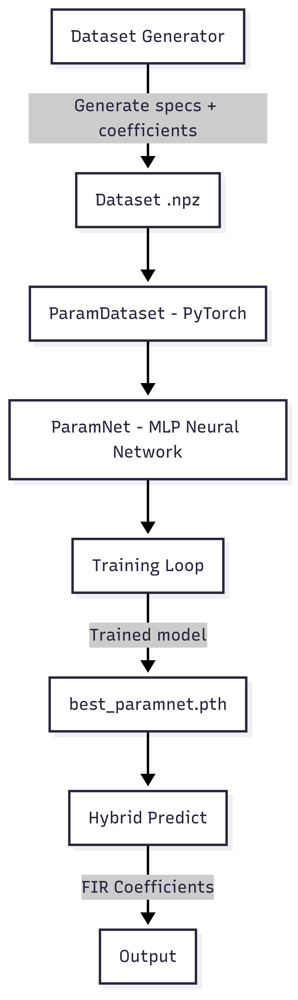

# **FIR Filters with Neural Networks**
This project explores how artificial neural networks can assist in the automatic design of FIR (Finite Impulse Response) filters, combining classical Digital Signal Processing (DSP) techniques with Machine Learning.

The idea is simple:

- The user provides specifications (cutoff frequency, ripple, attenuation, etc.).

- The neural network intelligently adjusts these specifications.

- The filter is synthesized (via SciPy) with optimized coefficients.

This makes the project useful both for learning DSP concepts and for real-world applications, such as real-time audio filtering.

## Motivation

Designing FIR filters manually can be tedious:

- Small adjustments in filter order or attenuation are often required to meet the constraints.

- Classical tools (remez, firwin) don’t always perfectly hit the desired specifications.

👉 The neural network works like an “automatic engineer”: it takes your request and slightly adjusts the parameters so the final filter truly meets practical requirements.


## Project Structure

```
📂 Project/
│── dataset_generator.py # Generate dataset with lowpass/highpass filters
│── hybrid_dataset.py # PyTorch Dataset class
│── hybrid_helpers.py # Utility functions (normalization, FIR synthesis, etc.)
│── hybrid_model.py # ParamNet neural network definition
│── hybrid_train.py # Training loop (PyTorch)
│── hybrid_predict.py # Inference functions (using trained model)
│── main_train.py # Training script (command line)
│── main_predict.py # Prediction and visualization script
│── checkpoints_hybrid/ # Folder for saving checkpoints
│ └── best_paramnet.pth # Trained model file
│── README.md # This file :)
```


### 📊 Dataset Generation

We use dataset_generator.py to create thousands of FIR filters (lowpass and highpass) with random parameters:

- Cutoff frequency (fc)

- Transition bandwidth (trans)

- Passband ripple (Rp)

- Stopband attenuation (As)

- Number of taps (order)

Each filter is designed using SciPy (remez or firwin) and stored in a dataset (fir_dataset.npz).

### 🧠 Neural Network Training (ParamNet)

ParamNet is an MLP (multi-layer perceptron) that learns to map specifications → normalized parameters.

Training is performed with MSE (Mean Squared Error) in the standardized space (hybrid_train.py).

The best model is saved in: 
```bash
checkpoints_hybrid/best_paramnet.pth
```

### Hybrid Prediction

Given filter specifications, the network predicts the natural parameters.

These parameters are passed to the synthesize_fir function, which uses SciPy (remez or firwin) to generate the FIR coefficients.

This ensures the final filter is always valid.

### Evaluation

The script main_predict.py compares the predicted filter (hybrid NN + SciPy) with the directly designed filter (SciPy only).

Metrics used:

- Mean Absolute Error (MAE) in dB between frequency responses.

- Correlation between FIR coefficients.

Plots include:

- Frequency response (dB).

- Phase response.

- FIR coefficients.

## Workflow



## 🖥️ Usage
🔹 Train the network
```bash
python main_train.py --dataset fir_dataset.npz --epochs 50 --batch_size 128
```
🔹 Predict a filter (normalized mode)
```bash
python main_predict.py --fc 0.25 --trans 0.05 --Rp 1 --As 60 --order 128 --type lowpass --method firwin
```
🔹 Predict a filter (Hz, interactive mode)
```bash
python main_predict_.py --interactive
```
🔹 Export coefficients]
```bash
python main_predict.py --fc 0.25 --trans 0.05 --Rp 1 --As 60 --order 128 --type highpass --export c
```
## ✅ Conclusion

This project demonstrates that:

- Neural networks can learn the behavior of classical DSP tools.

- The model acts as an automatic engineer, fine-tuning specifications for practical results.

- FIR filter theory + AI can be combined in a practical and didactic way.

🚀 Next steps:

- Extend to bandpass / bandstop filters.

- Optimize for real-time embedded systems.

- Build an interactive GUI for education.

📌 Developed for the PDS course.